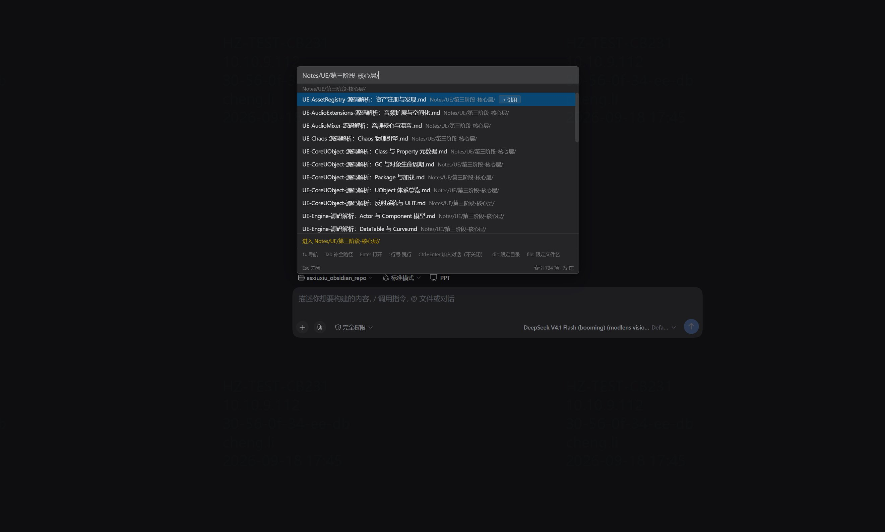

# dsh-quick-open

**DSH 的极速文件导航与引用插件**：VSCode 式 `Ctrl+P` 快速打开，外加对内置文件预览的两个刚需增强——文件内查找、选中加入会话。

> 5 万文件的工作区里，热查询中位数 **5ms**（`node scripts/bench.mjs` 可复现）。



**`Tab` 不只是补全路径**：落到目录上会把列表换成该目录的**直接子项**（目录在前、同级文件在后），可以一层层按进去；继续打字就回到模糊过滤。底部常驻键位提示与索引透明度（条目数 · 新鲜度）。

## 它解决什么问题

**1. 大仓库里找文件太慢、太难拼。**
工程仓库动辄几万文件，`client_module.cpp` 这种名字谁记得住全拼？本插件把 VSCode quick-open 的模糊打分器原样移植过来——`clntmod` 就能命中 `client_module.cpp`——再配上每工作区内存索引，按键即出结果。带 `/` 的路径查询做了逐段锚定（`login/index.html` 不会从五个不相干的目录里各借一个字母拼出假命中），`dir:` / `file:` 前缀可以精确限定匹配范围。

**2. 代码不都在一个仓库里。**
引擎仓库、游戏仓库、协议仓库并列存放，查一个问题经常要跨仓库跳。本插件的**外置文件夹索引**（`extraRoots`）让任意多个工作区外的目录并入同一个索引——一次 `Ctrl+P` 搜遍所有仓库，结果行带来源徽章（`engine/_source`、`game/_content`…），引用时自动切换成绝对路径。不用开第二个窗口，不用记"这个文件在哪个仓"。

**3. 给 AI 会话补充代码上下文，步骤太碎。**
找到文件 → 打开 → 选中 → 复制 → 切回输入框 → 粘贴 → 补路径……本插件把这条路压缩成两个动作：`Ctrl+Enter` 直接把文件作为 `@` 引用放进草稿（浮层不关，可以连加好几个）；在文件预览里选中一段代码，点浮出的「加入会话」，自动插入 `@路径:起止行` 的精确引用。

**4. DSH 内置文件预览不能搜。**
内置预览什么都能渲染（代码高亮、Markdown、HTML、PDF、图片），唯独没有文件内查找。本插件补上一条 `Ctrl+F` 浮动搜索条——对所有渲染器一视同仁地高亮命中，还顺手做了区分大小写、选区预填、「仅已加载」提示这些细节。**不接管、不替换内置预览，卸载即恢复原样。**

## 功能

### ⚡ 快速打开（`Ctrl+P`）

任意会话页面唤出，焦点纪律严格（键盘焦点永不离开搜索框）：

| 你要做的 | 怎么做 |
|---|---|
| 模糊找文件 | 直接输入，如 `clntmod` 命中 `client_module.cpp` |
| 按目录定位 | `ui/index.html`（逐段锚定，不会拼假命中） |
| 跳到指定行 | `main.cpp:120`（内置预览自动滚动并高亮该行） |
| 精确限定范围 | `dir:ui index.html`（ui 必须是目录段）、`file:index.html`（只匹配文件名），简写 `d:` / `f:`，见下节 |
| 重开上次文件 | `Ctrl+P` → `Enter`（空查询显示最近使用） |
| 目录逐级下钻 | `Tab` 补全，目录带 `/` 可连续按 |
| 引用进会话 | `Ctrl+Enter` 或点行尾「+ 引用」，**不关闭浮层**，可连续添加 |
| 打开文件 | `Enter`，走 DSH 原生右侧栏，与文件树点击同一条路径 |

- 匹配字符逐段高亮；深路径的目录部分**前置省略**，永远保住区分结果的那段
- 每工作区索引规则可配（设置页）：排除目录、强制包含生成目录、后缀白名单、是否索引目录
- **呼出快捷键可自定义**（设置页）：呼出面板、预览内搜索、加入会话三个动作都能改；默认 `Ctrl+P` / `Ctrl+F` / `Ctrl+Enter`，macOS 上按 `Cmd`
- footer 常驻索引透明度（条目数 · 新鲜度）与键位提示

#### ⌨️ 快捷键可自定义

三个动作都能改，默认值贴合各平台习惯：

| 动作 | 默认 | 说明 |
|---|---|---|
| 呼出快速打开面板 | `Ctrl+P` / macOS `Cmd+P` | 任意会话页面按下即可；再按一次关闭 |
| 在文件预览里搜索内容 | `Ctrl+F` / macOS `Cmd+F` | 焦点在侧边栏预览里时生效，打开浮动查找条 |
| 把选中文件加入对话 | `Ctrl+Enter` / macOS `Cmd+Enter` | 面板内按住修饰键回车，引用进草稿且**不关闭**面板 |

到设置页点一下录制按钮，按一次新组合即可，**立即生效不用刷新**。

两点设计：

- **跨平台按各自习惯解释**。设置里存的是「主修饰键」而不是写死的 Ctrl 或 Cmd，所以同一份配置在 macOS 上按 Cmd、在 Windows 上按 Ctrl——两边都符合本机习惯，不用分别配。
- **必须带修饰键**（其中 `Enter` 可单独作为主键）。不接受裸字母绑定，否则打字就会触发；录制时会直接拒绝并说明原因。

> ⚠️ **macOS 用户注意**：早期版本接受 `Ctrl+P` 或 `Cmd+P` 两种按法，现在默认**只认 `Cmd+P`**。如果您习惯按 `Ctrl+P`，到设置页重录一次即可（或直接接受 `Cmd+P`，它才是 macOS 的标准）。

#### 🎯 `dir:` 与 `file:` —— 限定这段文字该匹配哪里

一个查询由空格切成若干片段，每个片段可以用前缀限定**它在路径的哪一部分才算命中**：

| 写法 | 含义 | 例子 |
|---|---|---|
| `dir:ui` | 必须命中**某个目录段**，文件名不算 | `.../ui/coherent/bag/index.html` ✓<br>`ui_helpers.cpp`（只是文件名带 ui）✗ |
| `file:main.cpp` | 必须命中**文件名**，目录不算 | `.../camera/main.cpp` ✓<br>`.../main.cpp/helper.txt` ✗ |
| `d:` / `f:` | 同上，简写 | `d:ui f:index.html` |
| 无前缀 | 文件名优先，路径查询时回退到整条路径 | `clntmod`、`ui/index.html` |

可以混用，每个片段各管各的：

```
dir:camera file:manager      目录里有 camera 段，且文件名含 manager
dir:client cpp               client 必须是目录段，cpp 照常模糊匹配文件名
```

两个要点，实测确认：

- **匹配位置会如实高亮**。`dir:camera` 只高亮路径里的 `camera/`，文件名一个字母都不亮；`file:camera` 反之。看高亮就知道哪个片段命中了哪里。
- **`dir:` 要求目录名连续出现，`file:` 允许缩写**。这是刻意的不对称：目录是靠打出名字来点的（`dir:camera` 不会命中 `.../chaos_client_camera_effect_manager.cpp` 这种只是文件名带 camera 的），而文件名往往靠缩写抵达（`file:clntmod` 能命中 `client_module.cpp`）。
  所以 **`dir:clntmod` 找不到东西是正常的**——没有哪个目录段连续包含这串字母。想缩写找文件就用 `file:` 或不带前缀。

不写前缀时，`dir:` / `file:` 的行为完全不变：`clntmod`、`ui/index.html`、`main.cpp:120` 都照旧。

#### 📦 外置文件夹索引（`extraRoots`）

把工作区之外的任意目录并入同一个索引，多仓库开发不用切换上下文：

```jsonc
{
  "extraRoots": [
    { "path": "E:\\dev\\engine\\_source",  "label": "engine" },
    { "path": "E:\\dev\\game\\_content",   "label": "game" }
  ]
}
```

- 一次 `Ctrl+P` 搜遍所有根；结果行带来源徽章，深路径也能一眼认出是哪个仓
- 引用外置根的文件自动用绝对路径（`@E:/dev/engine/...`），AI 照常能读
- 每个根复用同一套排除/后缀规则，但按**各根自身**的相对路径匹配——某个根恰好位于名叫 `build` 的目录下，也不会被工作区自己的 `build` 排除规则误伤
- 跟随符号链接时逐根防环，目录不可读只跳过那一层，不会拖垮整个索引

### 🔍 文件预览增强

内置预览原有的渲染器切换、分页加载、变更提示、换行、行号跳转全部保留，本插件只加两样：

**文件内查找（`Ctrl+F`）**
- 浮动搜索条，随输入即时高亮全部命中（CSS Custom Highlight API，不改动预览的 DOM）
- 纯文本、代码高亮、Markdown 渲染视图通吃；`Enter` / `Shift+Enter` 前后跳转
- 选中一段文本再按 `Ctrl+F`，自动预填为查询词
- `Aa` 区分大小写开关（记住你的偏好）
- 分页加载的大文件会明确提示「仅已加载」——「无结果」不会被误读为「文件里没有」
- `Esc` 随处可关（不用先把焦点点回搜索框）

**选中即引用**
- 在预览里选中任意文本 → 点浮出的「加入会话」→ 插入 `@相对路径:起止行`
- Markdown 等渲染视图里同样可用（无行号时退化为 `@路径`）
- 引用格式三选一（设置页）：仅位置（默认，最省上下文）/ 位置+读取提示 / 围栏代码块（自包含）

<!-- 截图位：建议补三张——Ctrl+P 结果列表、文件内查找高亮、选中浮框 -->

## 安装

```bash
dsh plugin --profile web add github:asxiuxiu/dsh-quick-open   # GitHub 源
dsh plugin --profile web add dsh-quick-open                   # npm 源
dsh plugin --profile web add link:D:/dev/dsh-quick-open       # 本地开发
```

安装后**重启 DSH**（host 半只在 boot 时挂载）。只依赖 DSH 本体，不依赖任何第三方侧边栏插件。

## 配置（可选）

开箱即用：没有配置文件时使用内置的**语言中立、项目中立**默认规则（只排除各生态公认的噪音目录 + 跨语言通用源码后缀）。

需要定制时，「设置 → Quick Open 索引」编辑**当前工作区**的 `.dsh/quick-open.json`：

```jsonc
{
  "version": 1,
  "excludeDirs": ["_install", "build/Engine"],      // 裸名字任意深度；带斜杠锚定根；**/ 任意深度
  "includeDirs": ["build/p/include"],               // 优先级高于排除——救回被误伤的生成树
  "includeExtensions": [".h", ".cpp", ".py", ".md"],
  "includeFilenames": ["CMakeLists.txt"],
  "includeDirectories": true,
  "extraRoots": [                                    // 工作区外的目录一并索引
    { "path": "E:\\path\\to\\sibling-repo\\_source", "label": "sibling/_source" }
  ]
}
```

保存原子写入、3 秒内生效、无需重启。规则为什么按工作区存放、后缀白名单的固有盲区、`includeDirs` 为什么能救回生成树——详见下文架构与 `docs/`。

## 技术亮点

- **匹配器是 VSCode quick-open 打分器的移植**（`fuzzyScorer.ts` + `filters.ts`，常数与分档取自源码）。先试过 8 种自创方案，每一种都在另一组查询上崩掉；VSCode 的 `1<<16` 量级分档基数从根本上决定了「命中文件名」永远压过「命中路径」，**没有需要调的权重**。实验与负结果：`docs/matching-research.md`
- **路径查询逐段锚定**：不锚定时 `login/index.html` 实测有 27,002 条散落假命中（占全库 52.7%），正确答案埋在 130:1 的噪音里；锚定后从 620 条收敛到 7 条、全部正确
- **索引管线**：16 路并行 `readdir` 建每工作区内存索引，TTL 30s + stale-while-revalidate 保鲜，配置改动 3 秒内热感知，配置写入原子化
- **预览增强是 DOM 层装饰**：不注册 tab 类型、不补丁任何 DSH 包；查找高亮走 CSS Custom Highlight API，不触碰 React 托管的节点；选区引用直接读文档选区——因此对所有渲染器（含 PDF 文本层）一致生效
- **验证纪律**：构建产物跑端到端桩测试（注册契约、键盘路由、搜索计数、引用写入、层级契约），关键断言都经过「故意改坏必须失败」的有效性验证

## 开发

```bash
npm install
npm run build       # 产出 lib/index.js（host：索引路由）+ lib/client.js（__ModuleLoader__ 封装，约 80KB）
npm run typecheck

# 验证脚本
node scripts/verify.mjs                  # 匹配质量回归
node scripts/verify-no-regression.mjs    # 不含分隔符的查询行为逐条对比
node scripts/verify-grammar.mjs          # dir:/file: 前缀解析边界
node --experimental-strip-types scripts/verify-file-address.mjs   # 文件地址 / @ 引用 / :行号 后缀
node --experimental-strip-types scripts/verify-preview.mjs        # 预览增强纯逻辑
node scripts/verify-client-bundle.mjs    # 构建产物的端到端桩测试
node --expose-gc scripts/eval-cost.mjs   # 索引体积基线
node scripts/eval-ambiguity.mjs          # 目录名歧义量化
```

## 架构

```
src/rules.ts            索引规则：目录匹配（子树语义 + **/ glob）/ 文件过滤 / 配置解析
src/match.ts            VSCode 打分器移植 + dir:/file: 作用域前缀解析
src/index.ts            host 半：/quick-open/api/{search,children,probe,config.get,config.set,config.reset}
src/client/index.tsx    client 入口：全局快捷键监听 + 预览增强挂载 + slot 注册
src/client/controller.ts 搜索管线（查询缓存/索引路由/目录下钻）、:行号 解析、打开、引用、最近记录
src/client/quick-open.tsx 浮层组件（portal 到 body，z-index 10000，多段高亮）
src/client/settings.tsx 设置面板：索引规则 + 引用格式 + 呼出快捷键录制
src/client/shortcut.ts  快捷键：跨平台主修饰键映射、匹配、录制、校验、持久化
src/client/preview/     预览增强：查找条（Highlight API）+ 选中浮框 + DOM 探测（全部优雅降级）
docs/                   匹配调研、目录筛选评估、侧边栏集成调研、架构说明（含大量实测数据与负结果）
```

## 路线图

1. **全文搜索模式**：`%query` 前缀切换内容检索
2. **拼音/首字母匹配**：中文文件名的拼音检索
3. **多选批量引用**：`Ctrl+Space` 标记多行，一次加入会话
4. **`fs.watch` 精准失效**：索引实时跟随文件变更（替代/补充 TTL）
5. **文件树 reveal**：目录「在文件树中显示」——需要 DSH 文件树先暴露定位 API
6. **`dir:` 查询提速**：目录段倒排索引（+4.3MB，占总索引 19%），见 `docs/dir-filter-evaluation.md`

## License

MIT
