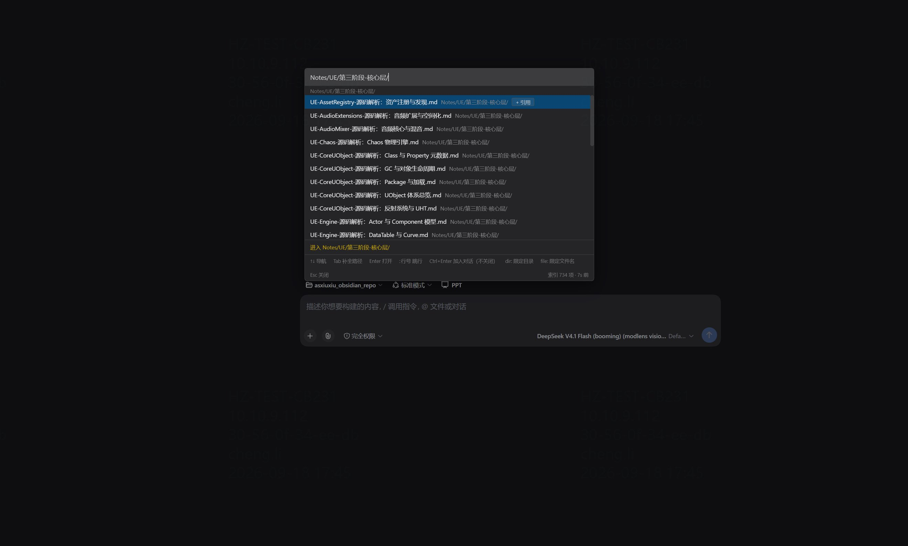

# dsh-quick-open

**Fast file navigation and referencing for DSH**: VSCode-style `Ctrl+P` quick open, plus two missing pieces of the built-in file preview — find-in-file and add-selection-to-conversation.

> Median hot query over a 50,000-file workspace: **5 ms** (reproduce with `node scripts/bench.mjs`).

English | [中文](README.zh.md)



**`Tab` does more than complete a path**: landing on a directory swaps the list for that directory's **direct children** (directories first, then sibling files), so you can drill down one level at a time; keep typing and you are back to fuzzy filtering. Key hints and index transparency (entry count · freshness) stay pinned to the footer.

## What it solves

**1. Finding a file in a large repository is slow, and the names are unguessable.**
Production repositories run to tens of thousands of files, and nobody remembers how to spell `client_module.cpp`. This plugin ports VSCode's quick-open fuzzy scorer verbatim — `clntmod` finds `client_module.cpp` — over a per-workspace in-memory index, so results appear as you type. Path queries containing `/` are anchored segment by segment (`login/index.html` will not assemble a false hit by borrowing one letter from each of five unrelated directories), and the `dir:` / `file:` prefixes scope a term precisely.

**2. Your code does not live in one repository.**
Engine, game, and protocol repositories sit side by side, and chasing one issue means hopping between them. **Extra index roots** (`extraRoots`) fold any number of directories outside the workspace into the same index — one `Ctrl+P` searches every repository, result rows carry a source badge (`engine/_source`, `game/_content`, …), and references switch to absolute paths automatically. No second window, and no remembering which repository a file belongs to.

**3. Feeding code context to an AI conversation takes too many steps.**
Find file → open → select → copy → switch back to the composer → paste → fix the path… This plugin compresses that into two gestures: `Ctrl+Enter` drops the file into the draft as an `@` reference (the palette stays open, so you can add several in a row); and selecting code in the file preview and clicking the floating "Add to conversation" inserts a precise `@path:start-end` reference.

**4. The built-in DSH file preview cannot search.**
The built-in preview renders everything (code highlighting, Markdown, HTML, PDF, images) except find-in-file. This plugin adds a `Ctrl+F` floating find bar that highlights matches uniformly across every renderer, with case sensitivity, selection prefill, and a "loaded part only" notice. **It takes over nothing and replaces nothing: uninstalling restores the stock preview exactly.**

## Features

### ⚡ Quick open (`Ctrl+P`)

Summoned from any session page, with strict focus discipline (keyboard focus never leaves the search box):

| What you want | How |
|---|---|
| Fuzzy-find a file | Just type, e.g. `clntmod` matches `client_module.cpp` |
| Locate by directory | `ui/index.html` (anchored per segment, so no false hits) |
| Jump to a line | `main.cpp:120` (the built-in preview scrolls to and highlights that line) |
| Scope a term precisely | `dir:ui index.html` (ui must be a directory segment), `file:index.html` (filename only); shorthand `d:` / `f:` — see below |
| Reopen the last file | `Ctrl+P` → `Enter` (an empty query shows recently used) |
| Drill into directories | `Tab` completes; a directory keeps its trailing `/` and can be pressed repeatedly |
| Reference into the conversation | `Ctrl+Enter`, or click "+ Reference" at the row's end — **the palette stays open**, so you can add several |
| Open the file | `Enter` — goes through DSH's native right Sidebar, the same path a file-tree click takes |

- Matched characters are highlighted per segment; a deep path's directory part is **front-elided**, so the segment that distinguishes one row from another is never the part that gets clipped
- Index rules are configurable per workspace (settings page): excluded directories, force-included generated directories, extension allowlist, whether directory entries are indexed
- **Every shortcut is customizable** (settings page): the palette, the in-preview search, and the reference gesture can all be rebound; defaults are `Ctrl+P` / `Ctrl+F` / `Ctrl+Enter`, or `Cmd` on macOS
- The footer permanently shows index transparency (entry count · freshness) and key hints

#### ⌨️ Customizable shortcuts

All three actions can be rebound, with defaults that match each platform's habits:

| Action | Default | Notes |
|---|---|---|
| Open the quick-open palette | `Ctrl+P` / macOS `Cmd+P` | Works on any session page; press again to close |
| Search within the file preview | `Ctrl+F` / macOS `Cmd+F` | Applies while the sidebar preview has focus; opens the floating find bar |
| Add the highlighted file to the conversation | `Ctrl+Enter` / macOS `Cmd+Enter` | Hold the modifier and press Enter inside the palette; the reference lands in the draft and the palette **stays open** |

Open the settings page, click the record button, and press the new combination once — it takes effect **immediately, with no reload**.

Two design decisions:

- **Each platform interprets the primary modifier its own way.** What gets stored is "the primary modifier", not a hardcoded Ctrl or Cmd, so one configuration means Cmd on macOS and Ctrl on Windows — correct on both, with nothing to configure twice.
- **A modifier is required** (though `Enter` may be the main key on its own). Bare-letter bindings are refused, because they would fire while you type; the recorder rejects them outright and explains why.

> ⚠️ **macOS users**: earlier versions accepted either `Ctrl+P` or `Cmd+P`; the default now recognises **`Cmd+P` only**. If you are used to `Ctrl+P`, re-record it on the settings page (or just adopt `Cmd+P`, which is the macOS standard).

#### 🎯 `dir:` and `file:` — scoping where a term is allowed to match

A query is split on spaces into terms, and each term may carry a prefix restricting **which part of the path counts as a match**:

| Spelling | Meaning | Example |
|---|---|---|
| `dir:ui` | Must match a **directory segment**; the filename does not count | `.../ui/coherent/bag/index.html` ✓<br>`ui_helpers.cpp` (ui only in the filename) ✗ |
| `file:main.cpp` | Must match the **filename**; directories do not count | `.../camera/main.cpp` ✓<br>`.../main.cpp/helper.txt` ✗ |
| `d:` / `f:` | The same, abbreviated | `d:ui f:index.html` |
| no prefix | Filename first, falling back to the whole path for path queries | `clntmod`, `ui/index.html` |

Prefixes mix freely, each term governing itself:

```
dir:camera file:manager      a camera segment in the path, and "manager" in the filename
dir:client cpp               client must be a directory segment; cpp fuzzy-matches the filename as usual
```

Two properties, confirmed by measurement:

- **Match positions are highlighted faithfully.** `dir:camera` highlights only `camera/` in the path and not a single letter of the filename; `file:camera` is the reverse. The highlight tells you which term matched where.
- **`dir:` requires the directory name to appear contiguously; `file:` allows abbreviations.** This asymmetry is deliberate: directories are targeted by typing their name (`dir:camera` will not match `.../chaos_client_camera_effect_manager.cpp`, whose filename merely contains "camera"), whereas filenames are usually reached by abbreviation (`file:clntmod` matches `client_module.cpp`).
  So **`dir:clntmod` finding nothing is expected** — no directory segment contains those letters contiguously. Use `file:` or no prefix to abbreviate a filename.

With no prefix, `dir:` / `file:` change nothing: `clntmod`, `ui/index.html`, and `main.cpp:120` all behave as before.

#### 📦 Extra index roots (`extraRoots`)

Fold any directory outside the workspace into the same index, so multi-repository work needs no context switching:

```jsonc
{
  "extraRoots": [
    { "path": "E:\\dev\\engine\\_source",  "label": "engine" },
    { "path": "E:\\dev\\game\\_content",   "label": "game" }
  ]
}
```

- One `Ctrl+P` searches every root; result rows carry a source badge, so a deep path is still instantly attributable to a repository
- Referencing a file from an extra root uses an absolute path (`@E:/dev/engine/...`) automatically, and the AI can read it as usual
- Every root reuses the same exclude/extension rules, but matched against **its own** relative paths — a root that happens to sit under a directory named `build` is not caught by the workspace's own `build` exclude
- Symlink traversal is cycle-guarded per root, and an unreadable directory skips only that level rather than stalling the whole index

### 🔍 File preview enhancements

The built-in preview keeps its renderer switching, paged loading, change notices, line wrapping, and line jumps. This plugin adds exactly two things:

**Find in file (`Ctrl+F`)**
- A floating find bar that highlights every match as you type (CSS Custom Highlight API; the preview's DOM is not modified)
- Works across plain text, highlighted code, and rendered Markdown views; `Enter` / `Shift+Enter` step through matches
- Select some text, then press `Ctrl+F`, and it is prefilled as the query
- An `Aa` case-sensitivity toggle that remembers your preference
- A large paged file says "loaded part" explicitly, so "no results" is not misread as "not in the file"
- `Esc` closes it from anywhere (no need to click back into the search box first)

**Select to reference**
- Select any text in the preview → click the floating "Add to conversation" → an `@relative/path:start-end` reference is inserted
- Works in rendered views such as Markdown too (degrading to a bare `@path` when the renderer exposes no line numbers)
- Three reference formats (settings page): location only (the default, cheapest in context) / location + read hint / fenced code block (self-contained)

<!-- Screenshot slots: ideally three — the Ctrl+P result list, find-in-file highlighting, and the selection popup -->

## Install

```bash
dsh plugin --profile web add dsh-quick-open                   # from npm
dsh plugin --profile web add github:asxiuxiu/dsh-quick-open   # from GitHub
dsh plugin --profile web add link:D:/dev/dsh-quick-open       # local development
```

**Restart DSH after installing** (the host half mounts only at boot). It depends on DSH itself and on no third-party sidebar plugin.

## Configuration (optional)

It works out of the box: with no config file it uses built-in **language-neutral, project-neutral** defaults (excluding only the noise directories every ecosystem agrees on, plus source extensions common across languages).

To customize, open **Settings → Quick Open index** and edit the **current workspace's** `.dsh/quick-open.json`:

```jsonc
{
  "version": 1,
  "excludeDirs": ["_install", "build/Engine"],      // bare name at any depth; with a slash, anchored to the root; **/ for any depth
  "includeDirs": ["build/p/include"],               // takes precedence over excludes — rescues a wrongly swept generated tree
  "includeExtensions": [".h", ".cpp", ".py", ".md"],
  "includeFilenames": ["CMakeLists.txt"],
  "includeDirectories": true,
  "extraRoots": [                                    // directories outside the workspace, indexed together
    { "path": "E:\\path\\to\\sibling-repo\\_source", "label": "sibling/_source" }
  ]
}
```

Saving is atomic, takes effect within 3 seconds, and needs no restart. Why the rules are stored per workspace, the inherent blind spot of an extension allowlist, and why `includeDirs` can rescue a generated tree — see the architecture section below and `docs/`.

## Technical highlights

- **The matcher is a port of VSCode's quick-open scorer** (`fuzzyScorer.ts` + `filters.ts`, with constants and score tiers taken from the source). Eight original schemes were tried first, and every one broke on another set of queries; VSCode's `1<<16`-scale tiering fundamentally guarantees that "matched the filename" always outranks "matched the path" — **there are no weights to tune**. Experiments and negative results: `docs/matching-research.md`
- **Path queries are anchored per segment**: unanchored, `login/index.html` measured 27,002 scattered false hits (52.7% of the index), burying the correct answer in 130:1 noise; anchored, it converges from 620 candidates to 7, all correct
- **Index pipeline**: 16-way parallel `readdir` builds a per-workspace in-memory index, kept fresh by a 30 s TTL with stale-while-revalidate, noticing config changes within 3 seconds, with atomic config writes
- **The preview enhancement is a DOM-layer decoration**: it registers no tab type and patches no DSH package; find highlighting uses the CSS Custom Highlight API and never touches React-managed nodes; selection referencing reads the document selection directly — which is why it works uniformly across every renderer (including the PDF text layer)
- **Verification discipline**: the built artifacts run through end-to-end stub tests (registration contract, keyboard routing, match counts, reference writes, layering contract), and the load-bearing assertions are each validated by "deliberately break it, it must fail"

## Development

```bash
npm install
npm run build       # emits lib/index.js (host: the index routes) + lib/client.js (the __ModuleLoader__ envelope, ~80KB)
npm run typecheck
npm run check       # typecheck + build + the client-bundle suite

# Verification scripts
node scripts/verify-i18n.mjs             # key parity, no untranslated/empty values, placeholder survival
node scripts/verify-client-bundle.mjs    # end-to-end stub test of the built artifact (incl. Ctrl+P being claimed)
node scripts/verify-grammar.mjs          # dir:/file: prefix parsing boundaries
node --experimental-strip-types scripts/verify-file-address.mjs   # file addresses / @ references / :line suffix
node --experimental-strip-types scripts/verify-preview.mjs        # preview-augmentation pure logic
node scripts/verify.mjs                  # match-quality regression
node scripts/verify-no-regression.mjs    # per-case comparison of separator-less query behaviour
node --expose-gc scripts/eval-cost.mjs   # index size baseline
node scripts/eval-ambiguity.mjs          # quantifying directory-name ambiguity
```

> Some scripts (`verify.mjs`, `verify-children.mjs`, `verify-drill.mjs`, `verify-no-regression.mjs`) read a real workspace at a hardcoded path and exit with `ENOENT` unless that path exists. Point them at your own checkout before running.

## Architecture

```
src/rules.ts             index rules: directory matching (subtree semantics + **/ globs) / file filtering / config parsing
src/match.ts             the VSCode scorer port + dir:/file: scope-prefix parsing
src/index.ts             host half: /quick-open/api/{search,children,probe,config.get,config.set,config.reset}
src/client/index.tsx     client entry: global shortcut listener + preview-augmentation mount + slot registrations
src/client/i18n.ts       every user-visible string, in English and Chinese, with language resolution
src/client/controller.ts the search pipeline (query cache / index route / directory drill), :line parsing, open, reference, recents
src/client/quick-open.tsx the palette component (portal to body, z-index 10000, multi-segment highlighting)
src/client/settings.tsx  settings panel: index rules + reference format + shortcut recording
src/client/shortcut.ts   shortcuts: cross-platform primary-modifier mapping, matching, recording, validation, persistence
src/client/preview/      preview augmentation: find bar (Highlight API) + selection popup + DOM probing (all gracefully degrading)
docs/                    matching research, directory-filter evaluation, sidebar integration research, architecture notes (with measurements and negative results)
```

## Internationalization

The plugin ships **English and Chinese**. Language follows the DSH shell's own locale preference (`<html lang>`), is re-read on every lookup so switching needs no reload, and anything that is not `zh*` resolves to English.

Every user-visible string lives in one table, `src/client/i18n.ts`. That is enforced rather than merely intended:

- Both tables are typed `Messages`, so a key added to English and forgotten in Chinese is a **compile error**
- `scripts/verify-i18n.mjs` asserts key parity, rejects empty values, rejects a Chinese value identical to its English counterpart (a forgotten translation), and requires every `{placeholder}` to survive translation
- The language switch reaches the **composer draft text**, not just the UI chrome — `verify-i18n.mjs` covers that too

## Roadmap

1. **Full-text search mode**: a `%query` prefix switching to content search
2. **Pinyin / initial matching**: romanized search for Chinese filenames
3. **Multi-select batch reference**: `Ctrl+Space` to mark several rows and add them in one action
4. **Precise `fs.watch` invalidation**: keep the index live with file changes (replacing or supplementing the TTL)
5. **File-tree reveal**: "reveal in file tree" for a directory — needs DSH's file tree to expose a locate API first
6. **Faster `dir:` queries**: an inverted index over directory segments (+4.3 MB, 19% of the total index), see `docs/dir-filter-evaluation.md`

## License

MIT
